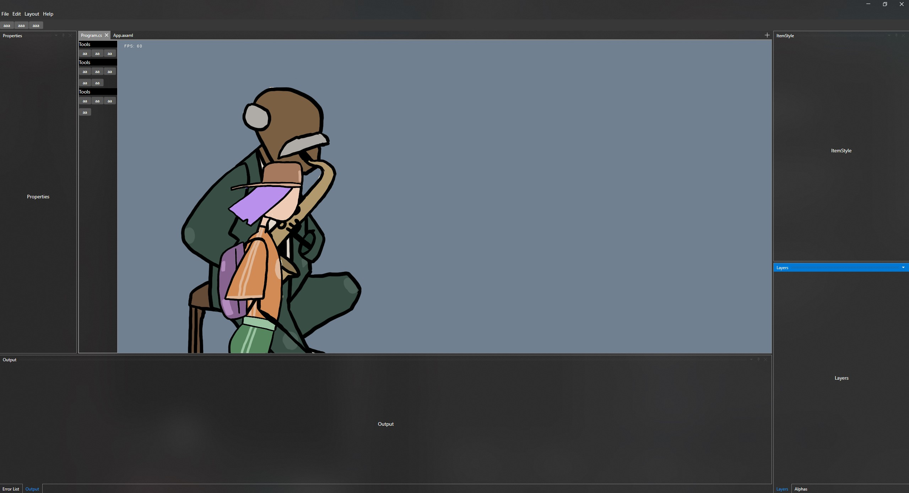

# 🕹 Avalonia + Avalonia.Dock + MonoGame Template

## 🎯 Overview
This is a project template combining **Avalonia**, **Avalonia.Dock**, and **MonoGame**, designed to create a modern, cross-platform application with a docking UI and game rendering capabilities. The template allows seamless integration between Avalonia's UI framework and MonoGame's rendering engine.

⚠ **Disclaimer:** This project is a **first draft** and is provided **as-is**. I am **not responsible** for its functionality or stability.

## 📦 Features
- 🎨 **Avalonia UI** – Cross-platform UI framework for .NET applications.
- 🔲 **Avalonia.Dock** – Docking system for multi-window or modular interfaces.
- 🎮 **MonoGame** – Game development framework for 2D/3D rendering.
- 🏗 **Modular & Extensible** – Easily customizable for different use cases.
- 🖥 **Cross-Platform** – Runs on **Windows, Linux, and macOS**.

## 🛠 Installation
### Prerequisites
Ensure you have the following installed:
- [.NET SDK 9+](https://dotnet.microsoft.com/en-us/download/dotnet/9.0)
- [MonoGame Framework](https://www.monogame.net/)
- (Optional) [Visual Studio 2022+](https://visualstudio.microsoft.com/) or [JetBrains Rider](https://www.jetbrains.com/rider/)

### Clone the Repository
```sh
# Clone this repository
git clone https://github.com/vilten/Avalonia-Monogame-Dock-Template
cd "Avalonia-Monogame-Dock-Template\Avalonia Monogame Dock Template"
```

### Build and Run
To build and run the project, execute:
```sh
# Restore dependencies
dotnet restore

# Build the project
dotnet build

# Run the application
cd bin\Debug\net9.0
dotnet exec MyApp.dll
cd ..\..\..
```

## 🚀 Usage
- **Avalonia UI:** Manages window and controls layout.
- **Avalonia.Dock:** Enables docking panels.
- **MonoGame Renderer:** Used for real-time graphics and rendering inside Avalonia.

## 📁 Project Structure
```
📦 YourProject
├── 📂 Assets            # Icons, textures, and other assets
├── 📂 Content           # Monogame content .mgcb
├── 📂 Controls          # Avalonia controls
├── 📂 Monogame          # Monogame code
├── 📂 Services          # Various services
├── 📂 Styles            # Avalonia styles
├── 📂 Themes            # Avalonia themes
├── 📂 Views             # UI Views (Avalonia)
├── 📂 ViewModels        # ViewModels for MVVM pattern
├── 📂 Game              # MonoGame-related logic
├── App.axaml           # Avalonia Application Entry Point
├── Settings.cs         # Application settings
├── Program.cs          # Application startup
└── README.md           # Project Documentation
```

## 🎨 UI Preview


## 🤝 Contributing
If you want to contribute:
1. Fork the repo
2. Create a feature branch (`git checkout -b feature-name`)
3. Commit changes (`git commit -m 'Add new feature'`)
4. Push to branch (`git push origin feature-name`)
5. Open a Pull Request

## 📜 License
This project is licensed under the [MIT License](LICENSE).

## 🙌 Acknowledgments
- [Avalonia UI](https://github.com/AvaloniaUI/Avalonia)
- [Avalonia.Dock](https://github.com/wieslawsoltes/Avalonia.Dock)
- [MonoGame](https://github.com/MonoGame/MonoGame)

## 👤 Author
Created by **[Viliam Tencer]** – [GitHub](https://github.com/vilten)

---
✨ *Happy coding!* 🚀